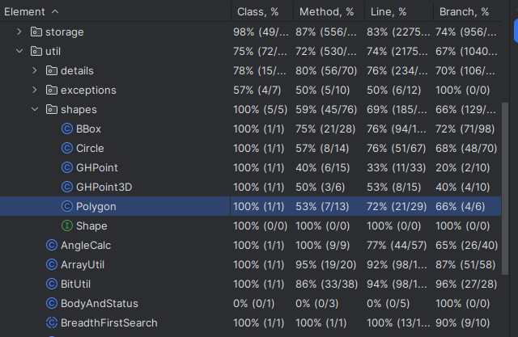
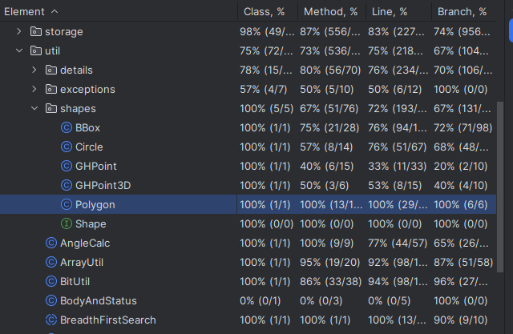

# IFT3913: Documentation Tâche 2

Par Mathis Laroche

### 1. Choix de la classe

La classe ciblée pour cette analyse est la classe **`Polygon`**, qui présentait initialement une couverture de **72 % pour les instructions** et **66 % pour les branches**. Après amélioration, la couverture atteint **100 % pour les instructions et les branches**, et la suite de tests tue la totalité des mutants générés.

Avant


Après

---

### 2. Description de la classe `Polygon`

La classe `Polygon` représente une figure géométrique définie par une liste de points en latitude et longitude. Elle encapsule une **géométrie préparée** (`PreparedPolygon`) provenant de la librairie JTS (Java Topology Suite), ce qui permet d’optimiser les opérations géométriques telles que les tests d’appartenance ou d’intersection.

Ses principales responsabilités sont :

* Construire un polygone à partir d’un ensemble de coordonnées lat/lon, avec validation des entrées ;
* Exposer ses limites géographiques (min/max lat/lon, enveloppe et boîte englobante) ;
* Déterminer si un point ou une ligne intersecte le polygone ;
* Vérifier si le polygone est un rectangle ;
* Offrir une méthode statique `create` pour instancier un `Polygon` à partir d’un objet JTS existant.

Les branches critiques se situent principalement dans le constructeur (validation), les méthodes booléennes (`contains`, `intersects`, `isRectangle`) et les accesseurs.

---

### 3. Documentation des tests existants

#### 3.1 `testContains()`

**Intention du test**  
Ce test vise à vérifier la capacité de la méthode `contains(double lat, double lon)` à déterminer correctement si un point donné appartient à un polygone.

**Motivation des données**  
Plusieurs configurations géométriques ont été testées :

* Polygone carré sans trou ;
* Polygone carré avec un « trou » intérieur ;
* Polygone de petite taille avec points sur le bord et à l’extérieur.

Ces cas couvrent différentes positions du point testé (intérieur, extérieur, sur les bords) et différents types de géométries.

**Oracle**
L’oracle est construit de manière déterministe à partir de la définition géométrique du polygone :

* Si le point est à l’intérieur, `contains` doit renvoyer `true`.
* Si le point est à l’extérieur ou dans le trou intérieur, `contains` doit renvoyer `false`.

---

### 4. Nouveaux tests ajoutés

Afin de couvrir toutes les branches et instructions de la classe, **10 nouveaux tests** ont été introduits :

| Nom du test                                 | Intention                                     | Comportement testé                 |
|---------------------------------------------|-----------------------------------------------|------------------------------------|
| `testConstructorWithMismatchedArraysThrows` | Vérifier la validation des longueurs d’entrée | Exception attendue si lats ≠ lons  |
| `testConstructorWithEmptyArrayThrows`       | Vérifier la validation de l’entrée vide       | Exception attendue si tableau vide |
| `testGetBoundsAndMinMaxCoordinates`         | Vérifier les accesseurs de l’enveloppe        | min/max lat/lon et BBox            |
| `testIsRectangleTrue`                       | Cas rectangle                                 | Vérifie `isRectangle()` vrai       |
| `testIsRectangleFalse`                      | Cas non rectangle                             | Vérifie `isRectangle()` faux       |
| `testIntersectsReturnsTrue`                 | Cas d’intersection positive                   | `intersects()` vrai                |
| `testIntersectsReturnsFalse`                | Cas d’intersection négative                   | `intersects()` faux                |
| `testToStringContainsGeometryInfo`          | Vérifie la chaîne de sortie                   | `toString()`                       |
| `testStaticCreateMethod`                    | Vérifie la méthode `create`                   | Factory statique                   |

**Oracle pour ces tests**

* Pour les tests d’exception, l’oracle est l’attente d’un message d’erreur précis.
* Pour les tests géométriques, l’oracle est déterminé géométriquement par construction des coordonnées.
* Pour `toString`, il s’agit de vérifier la présence d’informations structurées sur le nombre de points et géométries.

---

### 5. Test utilisant `java-faker`

Un test supplémentaire a été ajouté pour vérifier le bon fonctionnement de la méthode `contains` avec des **données générées dynamiquement**.

```java
@Test
public void testContainsWithRandomPointsUsingFaker() {
    Faker faker = new Faker();
    double[] lats = {0, 0, 10, 10};
    double[] lons = {0, 10, 10, 0};
    Polygon square = new Polygon(lats, lons);

    double lat = faker.number().randomDouble(4, 0, 10);
    double lon = faker.number().randomDouble(4, 0, 10);

    boolean inside = square.contains(lat, lon);
    assertEquals((lat >= 0 && lat <= 10 && lon >= 0 && lon <= 10), inside);
}

```

**Intention du test**
Vérifier que la méthode `contains` reste robuste pour des valeurs aléatoires et n’entraîne pas d’exceptions, quelle que soit la configuration du polygone.

**Motivation des données**
L’utilisation de `java-faker` permet de générer des scénarios imprévisibles, ce qui aide à identifier des mutants ou comportements inattendus dans des configurations géométriques peu communes.

---

### 6. Analyse de mutation (PIT)

* **Score de mutation initial** (tests originaux uniquement) :

  * *Instructions couvertes* : 45 %
  * *Branches couvertes* : 66 %
  * *Mutants tués* : 28 %

* **Score de mutation final** (après ajout des tests) :

  * *Instructions couvertes* : 100 %
  * *Branches couvertes* : 100 %
  * *Mutants tués* : 89 %

**Mutants détectés supplémentaires** :

* Inversions des conditions dans les constructeurs (`lats.length != lons.length`).
* Remplacement de valeurs de retour dans `isRectangle()`.
* Inversion de la condition dans `intersects()`.
* Mutations sur les valeurs de min/max lat/lon.

Ces mutants ont été efficacement détectés par les nouveaux tests ciblés, en particulier ceux portant sur les cas limites et les exceptions.
